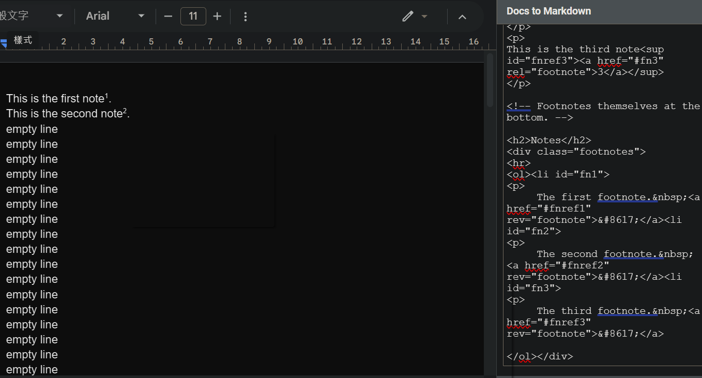
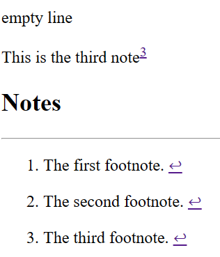
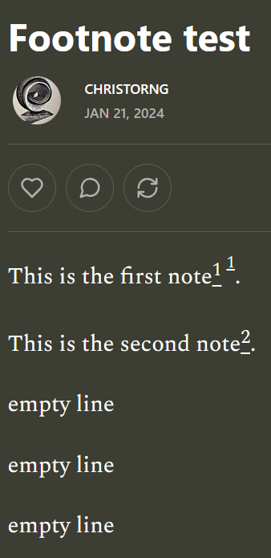

# My tests

Use 
[Docs to Markdown](https://workspace.google.com/marketplace/app/docs_to_markdown/700168918607) to convert Google Docs to HTML. Reference to [evbacher/gd2md-html Wiki](https://github.com/evbacher/gd2md-html/wiki).

If you can't install or turn on it, try to logout all account, relogin again to try.

I've shared mine: [Footnote test - Google Docs](https://docs.google.com/document/d/1_bQXisbPyvLiz2KtdGmKx8hsqh5L-gMAscXMJcDx3s8/edit?usp=sharing)

I've tried it's HTML output:

Copy all html and paste into an a.html (attached), view in browser:

These footnote works well.

Copy from the html page, paste into my Substack [Footnote test page](https://christorng.substack.com/p/ab2d1562-a0db-48af-9bad-9e66fad0dcfd):

The first 1 is from HTML, not working. The second 1 is from Substack native, works.

I've checked their differences. Should be able to overcome.

I have tried using [Tampermonkey](https://www.tampermonkey.net/) to hook on Stack editor, modify the pasted content succesfully, but not achieving goal yet.

I'm not considering [Google Extension](https://developer.chrome.com/docs/extensions/get-started), because that need a [$5 fee](https://chrome.google.com/webstore/devconsole/register) at first. I don't think it's necessary for this project.

# Curent plan

I plan to use Use 
[Docs to Markdown](https://workspace.google.com/marketplace/app/docs_to_markdown/700168918607) to convert Google Docs to HTML. Then use [Tampermonkey](https://www.tampermonkey.net/) to hook on Substack site. While pasting HTML into editor, convert to final format.

Currently the HTML of Docs to Markdown can't convert images, as [Feature Request: Flag to Convert Images to base64](https://github.com/evbacher/gd2md-html/issues/116) states. I need to overcome this problem first.

I'll create a minimal Google Docs to start with.