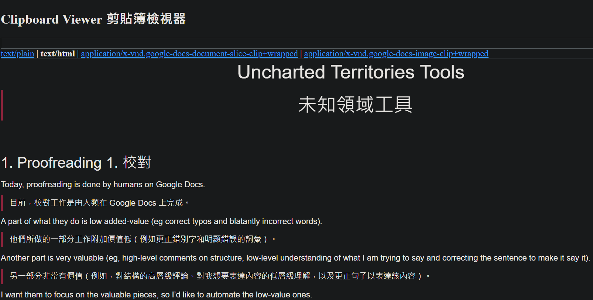
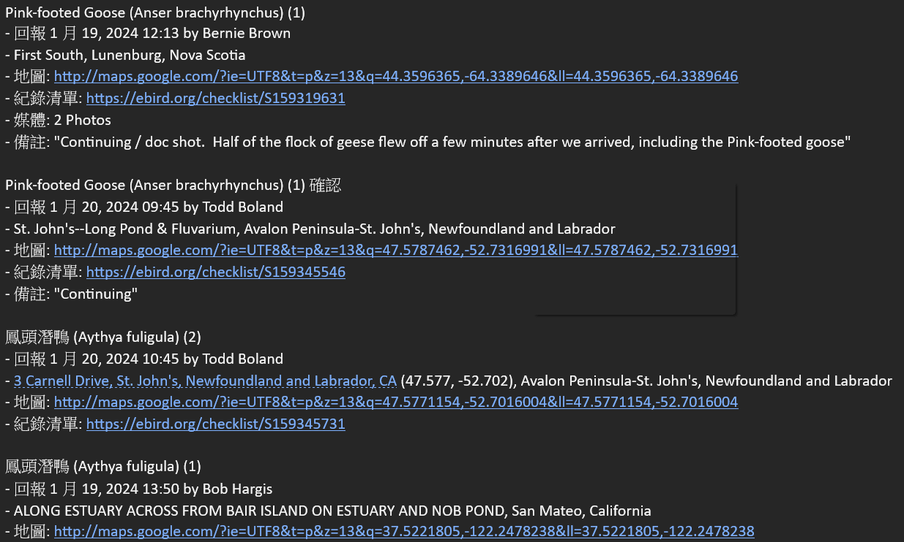
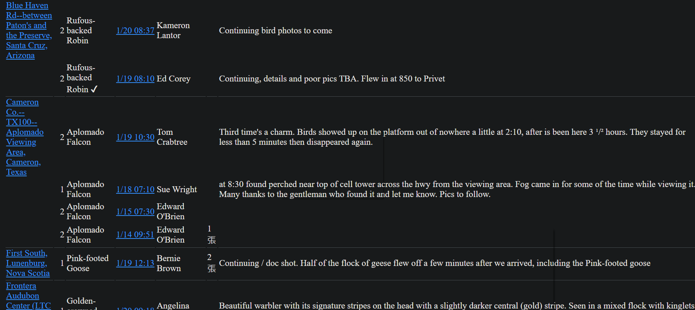
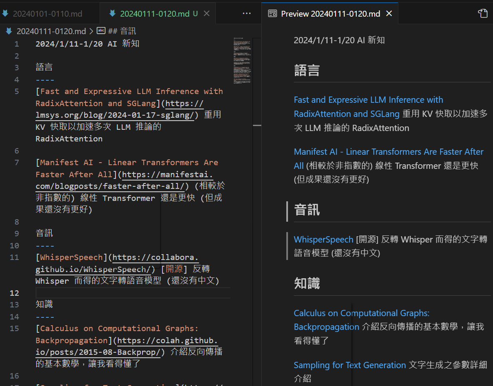
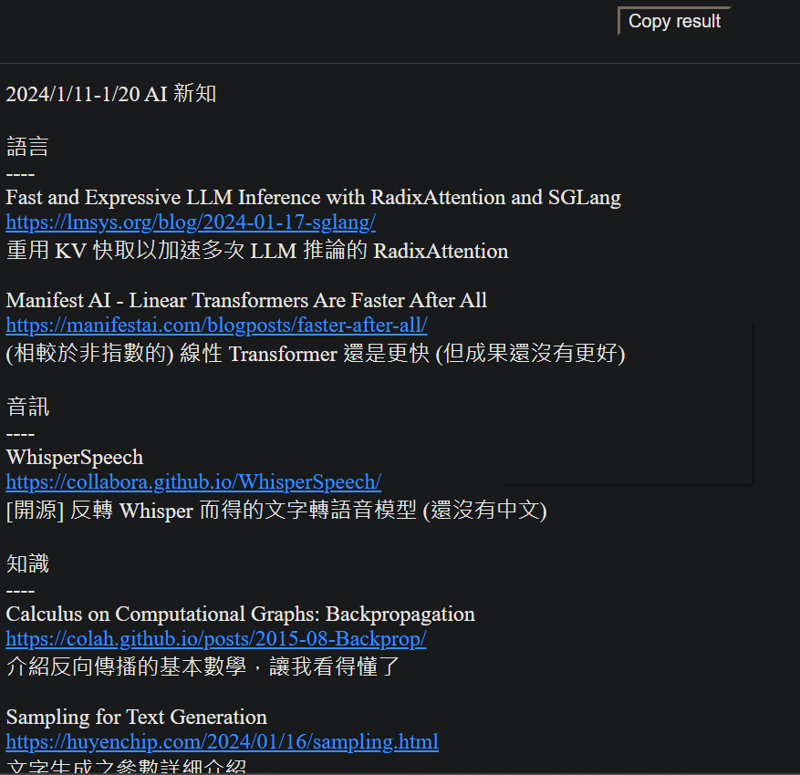

# My Previous experience on converting tool

I'm slow on reading English. In browser, it has embedding translator. But many tools have none, or poor one.

I created a [ClipboardViewer](https://christorng.github.io/InfoProcess/Clipboard/) for this. I can paste anything in, use the browser's translation tool to help me read, like this:

And I received [eBird Alert](https://ebird.org/alert/summary?sid=SN10489) email like this:

Using my tool [eBird Alert Summary](https://christorng.github.io/InfoProcess/eBird/), copy from email, paste into, convert the raw text to this table:

I write my substack article in markdown, using VSCode to convert to HTML:

I can copy the HTML and paste into Substack without problem.

But for FB, it can't accept HTML nor markdown. So I write this [little tool](https://christorng.github.io/BlogPosts/) to convert this specific format markdown into FB message:

You can try on this one:

---
語言

\[Fast and Expressive LLM Inference with RadixAttention and SGLang](https://lmsys.org/blog/2024-01-17-sglang/) 重用 KV 快取以加速多次 LLM 推論的 RadixAttention

\[Manifest AI - Linear Transformers Are Faster After All](https://manifestai.com/blogposts/faster-after-all/) (相較於非指數的) 線性 Transformer 還是更快 (但成果還沒有更好)

---
Copy the above and paste into this [little tool](https://christorng.github.io/BlogPosts/), click "Copy result", then you can get the converted result.
(It destructs the markdown URL into title and URL, split them into 3 lines instead of originally 1 line.)

They are on my public repo:

* [ChrisTorng/InfoProcess](https://github.com/ChrisTorng/InfoProcess)
* [ChrisTorng/BlogPosts](https://github.com/ChrisTorng/BlogPosts)